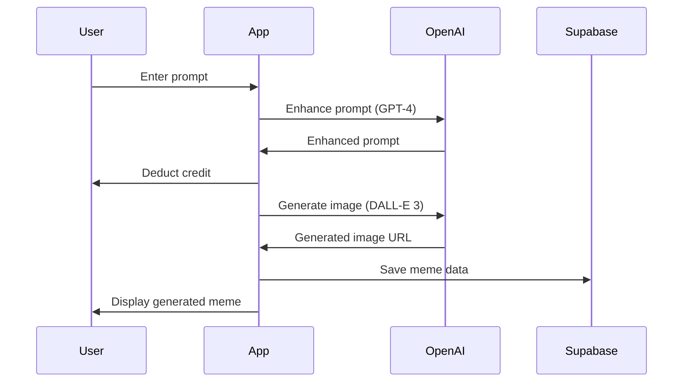
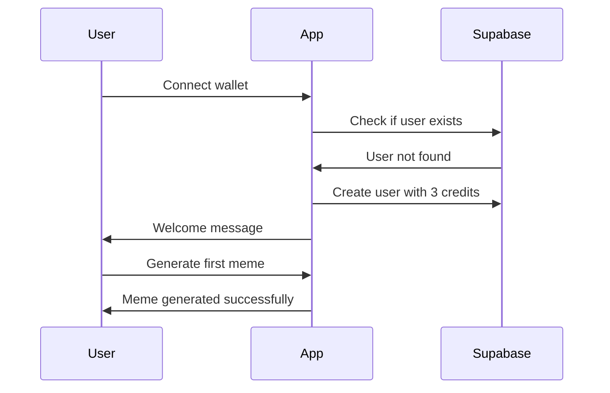
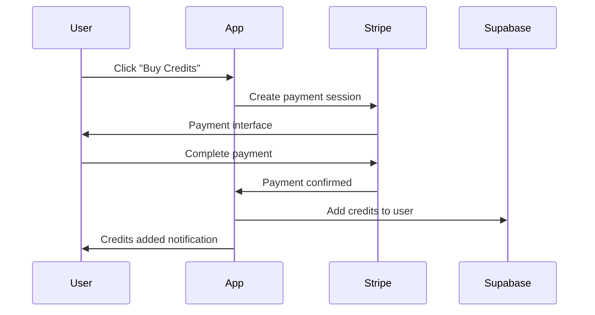

# MemeSynth API Documentation

## Overview

MemeSynth is a web application that allows users to generate memes using AI from text prompts and share them easily. This document outlines the technical specifications, API integrations, and implementation details.

## Architecture

### Frontend
- **Framework**: React 18 with Vite
- **Styling**: Tailwind CSS with custom design system
- **State Management**: React Context API
- **Wallet Integration**: RainbowKit + Wagmi
- **Notifications**: React Hot Toast

### Backend Services
- **Database**: Supabase (PostgreSQL)
- **Authentication**: Wallet-based authentication
- **Payments**: Stripe via x402-axios
- **AI Generation**: OpenAI API / OpenRouter

## API Integrations

### 1. OpenAI Images API

**Purpose**: Generate memes from text prompts using AI

**Endpoint**: `POST https://api.openai.com/v1/images/generations`

**Configuration**:
```javascript
{
  model: "dall-e-3",
  prompt: enhancedPrompt,
  n: 1,
  size: "1024x1024",
  quality: "standard",
  response_format: "url"
}
```

**Alternative**: OpenRouter API for access to multiple models
- **Endpoint**: `POST https://openrouter.ai/api/v1/images/generations`
- **Models**: `black-forest-labs/flux-1.1-pro`

### 2. OpenAI Chat Completions API

**Purpose**: Enhance user prompts for better meme generation

**Endpoint**: `POST https://api.openai.com/v1/chat/completions`

**Configuration**:
```javascript
{
  model: "gpt-4",
  messages: [
    {
      role: "system",
      content: "You are an expert meme creator..."
    },
    {
      role: "user", 
      content: `Enhance this meme idea: "${userPrompt}"`
    }
  ],
  max_tokens: 200,
  temperature: 0.7
}
```

### 3. Supabase API

**Purpose**: Backend as a Service for data storage and user management

**Base URL**: `https://[project-id].supabase.co/rest/v1/`

**Authentication**: API Key + Row Level Security

#### Database Schema

```sql
-- Users table
CREATE TABLE users (
  id UUID DEFAULT gen_random_uuid() PRIMARY KEY,
  wallet_address TEXT UNIQUE NOT NULL,
  email TEXT,
  credits INTEGER DEFAULT 3,
  total_memes_generated INTEGER DEFAULT 0,
  created_at TIMESTAMP WITH TIME ZONE DEFAULT NOW(),
  updated_at TIMESTAMP WITH TIME ZONE DEFAULT NOW()
);

-- Memes table
CREATE TABLE memes (
  id UUID DEFAULT gen_random_uuid() PRIMARY KEY,
  user_id UUID REFERENCES users(id),
  prompt TEXT NOT NULL,
  enhanced_prompt TEXT,
  image_url TEXT NOT NULL,
  template_used TEXT,
  is_demo BOOLEAN DEFAULT false,
  is_public BOOLEAN DEFAULT true,
  sharing_stats JSONB DEFAULT '{}',
  created_at TIMESTAMP WITH TIME ZONE DEFAULT NOW()
);

-- Payments table
CREATE TABLE payments (
  id UUID DEFAULT gen_random_uuid() PRIMARY KEY,
  wallet_address TEXT NOT NULL,
  amount DECIMAL(10,2) NOT NULL,
  credits_added INTEGER NOT NULL,
  status TEXT DEFAULT 'pending',
  transaction_hash TEXT,
  created_at TIMESTAMP WITH TIME ZONE DEFAULT NOW()
);

-- Analytics table
CREATE TABLE analytics (
  id UUID DEFAULT gen_random_uuid() PRIMARY KEY,
  user_id UUID REFERENCES users(id),
  action TEXT NOT NULL,
  metadata JSONB DEFAULT '{}',
  created_at TIMESTAMP WITH TIME ZONE DEFAULT NOW()
);
```

### 4. Stripe Payment API

**Purpose**: Process micro-transactions for credit purchases

**Integration**: Via x402-axios for Web3 payments

**Endpoint**: `POST https://payments.vistara.dev/api/payment`

**Configuration**:
```javascript
{
  amount: "$1.00",
  credits: 10
}
```

## Core Features Implementation

### 1. AI Meme Generation

**Flow**:
1. User enters text prompt
2. System enhances prompt using GPT-4
3. Enhanced prompt sent to DALL-E 3 or Flux
4. Generated image returned and saved
5. Meme added to user's gallery

**Code Example**:
```javascript
const memeData = await generateMemeWithAI(prompt);
await saveMeme({
  ...memeData,
  userId: user.id
});
```

### 2. Template-Based Meme Creation

**Templates Available**:
- Drake Pointing
- Distracted Boyfriend  
- This is Fine
- Surprised Pikachu
- Change My Mind
- Woman Yelling at Cat
- Two Buttons
- Galaxy Brain

**Implementation**: Canvas-based text overlay on template images

### 3. Social Sharing

**Platforms Supported**:
- Twitter/X
- Facebook
- Reddit
- WhatsApp
- Instagram (via URL copy)
- Direct download

**Sharing URLs**:
```javascript
// Twitter
`https://twitter.com/intent/tweet?text=${text}&url=${imageUrl}`

// Facebook
`https://www.facebook.com/sharer/sharer.php?u=${imageUrl}&quote=${text}`

// Reddit
`https://www.reddit.com/submit?url=${imageUrl}&title=${title}`

// WhatsApp
`https://wa.me/?text=${text}`
```

## User Flows

### 1. Meme Generation from Prompt



### 2. User Onboarding & First Generation



### 3. Credit Purchase Flow



## Error Handling

### API Failures
- **OpenAI API Down**: Fallback to demo mode with placeholder images
- **Supabase Unavailable**: Local state management with sync when available
- **Payment Failure**: Clear error messages and retry options

### User Experience
- **No Credits**: Clear messaging with purchase options
- **Wallet Not Connected**: Prompt to connect wallet
- **Network Issues**: Retry mechanisms and offline indicators

## Performance Optimizations

### Image Handling
- Lazy loading for gallery images
- Image compression for faster loading
- CDN integration for global distribution

### State Management
- Context-based state with optimistic updates
- Local caching of user data and memes
- Efficient re-rendering with React.memo

### API Optimization
- Request debouncing for search/suggestions
- Batch operations where possible
- Caching of frequently accessed data

## Security Considerations

### API Keys
- Environment variables for sensitive data
- Client-side API key rotation
- Rate limiting on API endpoints

### User Data
- Wallet-based authentication only
- No sensitive personal data storage
- GDPR compliance for EU users

### Content Moderation
- AI-generated content filtering
- User reporting mechanisms
- Automated content scanning

## Deployment Configuration

### Environment Variables
```bash
# Required
VITE_OPENAI_API_KEY=sk-...
VITE_SUPABASE_URL=https://...
VITE_SUPABASE_ANON_KEY=eyJ...

# Optional
VITE_OPENROUTER_API_KEY=sk-or-...
VITE_ANALYTICS_ID=G-...
```

### Build Configuration
```json
{
  "scripts": {
    "dev": "vite",
    "build": "vite build",
    "preview": "vite preview"
  }
}
```

### Docker Configuration
```dockerfile
FROM node:18-alpine
WORKDIR /app
COPY package*.json ./
RUN npm ci --only=production
COPY . .
RUN npm run build
EXPOSE 3000
CMD ["npm", "run", "preview", "--", "--host", "0.0.0.0", "--port", "3000"]
```

## Monitoring and Analytics

### Key Metrics
- Meme generation success rate
- User retention and engagement
- Payment conversion rates
- API response times

### Error Tracking
- Client-side error logging
- API failure monitoring
- User experience metrics

### Performance Monitoring
- Page load times
- Image generation speed
- Database query performance

## Future Enhancements

### Planned Features
1. **Advanced Templates**: More meme templates and customization options
2. **Collaborative Memes**: Multi-user meme creation
3. **Meme Contests**: Community-driven meme competitions
4. **NFT Integration**: Mint memes as NFTs
5. **Mobile App**: Native iOS/Android applications

### Technical Improvements
1. **Real-time Collaboration**: WebSocket integration
2. **Advanced AI**: Custom fine-tuned models
3. **Blockchain Integration**: On-chain meme storage
4. **Advanced Analytics**: ML-powered insights
5. **Multi-language Support**: Internationalization

## Support and Maintenance

### Documentation Updates
- API changes and versioning
- Feature additions and modifications
- Security updates and patches

### Community Support
- Discord/Telegram community
- GitHub issues and discussions
- User feedback integration

### Maintenance Schedule
- Weekly dependency updates
- Monthly security audits
- Quarterly feature releases
